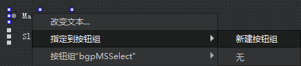

# 设置组合控件为**单选**(button、check Box、Radio Button):

* 在ui设计页面，选择多个按钮，右键添加指定按钮组



* 在源码编辑时创建按钮组，然后将按钮添加进按钮组当中

```cpp
QButtonGroup* bgpSelect = new QButtonGroup(this);
bgpSelect->addButton(ui.checkBox_1, 1);
bgpSelect->addButton(ui.checkBox_2, 2);
bgpSelect->addButton(ui.checkBox_3, 3);
bgpSelect->addButton(ui.checkBox_4, 4);
bgpSelect->addButton(ui.checkBox_5, 5);
```

